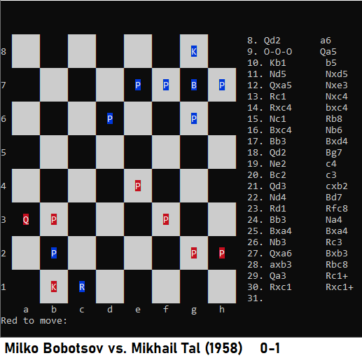

# CLIChess

 
 
Tested with Microsoft Visual Studio Community 2019
 
 
Due to the console-specific printing routines, the game is not portable to non-Windows platforms. 
(these routines are in the CLIChess.cpp clearScreen function and in the GameManager.cpp
printBoard-method)
 
 
Supports the following commands (typable either into the "[CLIChess] >" or the "... to move:" prompt): 
n - starts a new game. 
q - quits the program. 
l filename - loads the file with the given filename. 
m - prints the main menu
 
 
Three additional commands can be given during a chess game: (typable only into "... to move:" prompt): 
s filename - saves the current game into a file with the given file name. 
t # - takes back a user specified amount of moves; for example "t 5" takes back 5 moves.
b - prints the gameboard.
 
 
During the game, the user inputs moves in the algebraic chess notation, EXCEPT: 
The user does not have to input check, checkmate, promotion or En Passant moves.
 
 
Known issues:
 
 
1. If the user wants to type special notation (checks, En Passants, etc.), the game only
recognizes promotion moves and discards the rest of the special notations.
 
 
2. Any garbage can be inputted after a special move notation: the program happily parses
them out of the input string.
 
 
3. Due to the multi-phased nature that the move validation process is made (first initial parsing, then
intermediate information extraction, then the actual move validation and finally move committing, if
all has gone well so far - abandoning the entire move validation process at the first sight of an error
with no further processing performed afterwards), there are probably certain error messages that seem
weird or counter-intuitive to the users.
 
 
4. No stalemate after three identical board states implemented. However, all the other chess rules are implemented.
 
 
A note about the source code:
 
 
The original project requirements did not include any special moves (En Passants, Castling or Promotions).
Therefore my first idea was to focus mainly on the parsing of the moves given in the algebraic chess notation
form. Once I had gotten all the basic moves done, I felt that I wanted to try more: I wanted to make a real
chess program usable for any chess player to practice on (that's why there exists the possibility to take back
as many moves as the user likes, for example).
 
 
This decision, however, made the handling of those special moves a bit messy at certain areas. For example,
the castling and the promotion had to be handled separately and in a very different manner from the analysis
of normal moves.
 
 
The MoveAnalysisResults-ds with a purely public interface was designed for easy passing of any relevant
information between the parser, the move validator and the actual move maker. It (and some other parts of
the program) may not exactly follow the best OO practices, but it's a very convenient and performs its duty
very well.
 
 
There are still two or three "problem areas" in the code that are desperately in need of refactoring (like changing
the parser into a state machine instead of the current "ad hoc" solution, but overall, I'm very satisfied with the
results.